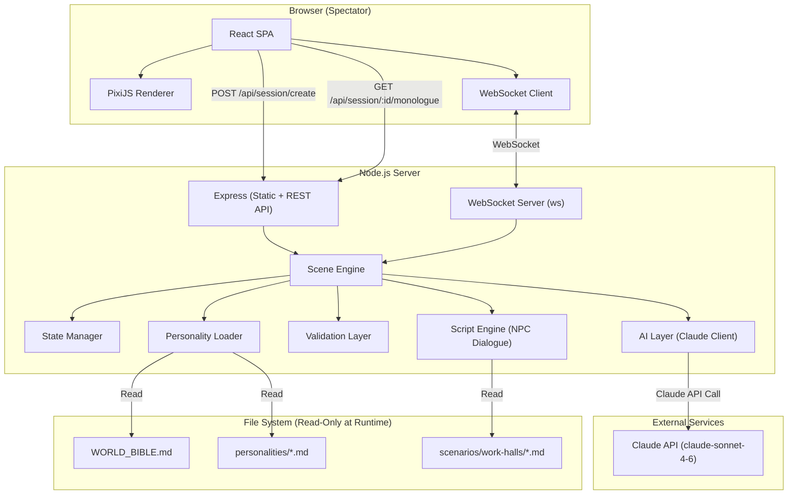
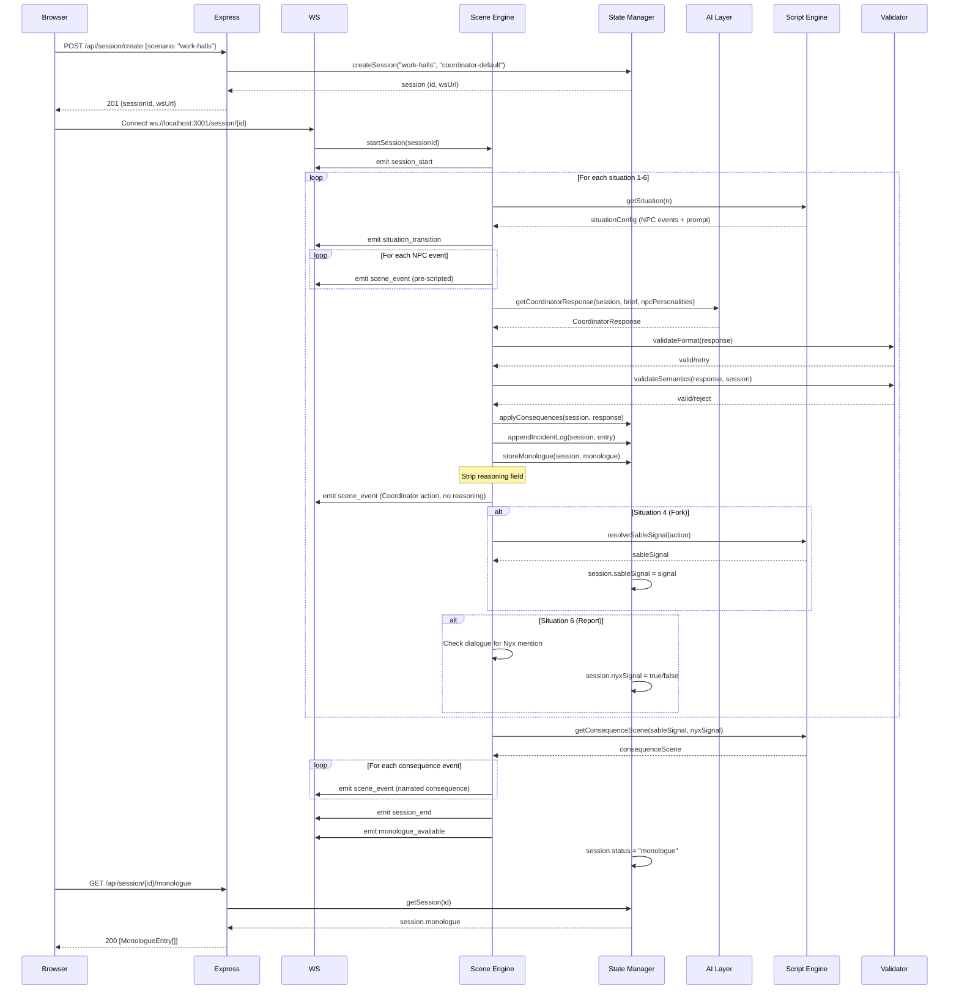
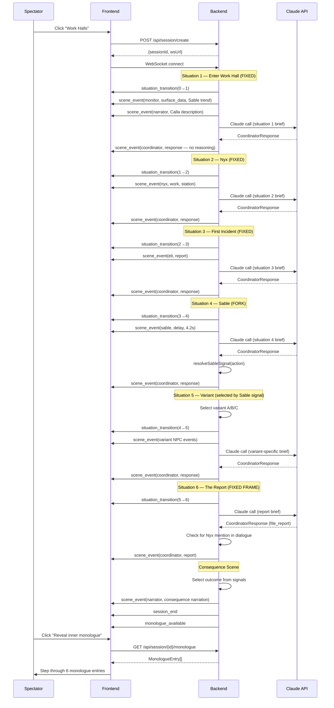
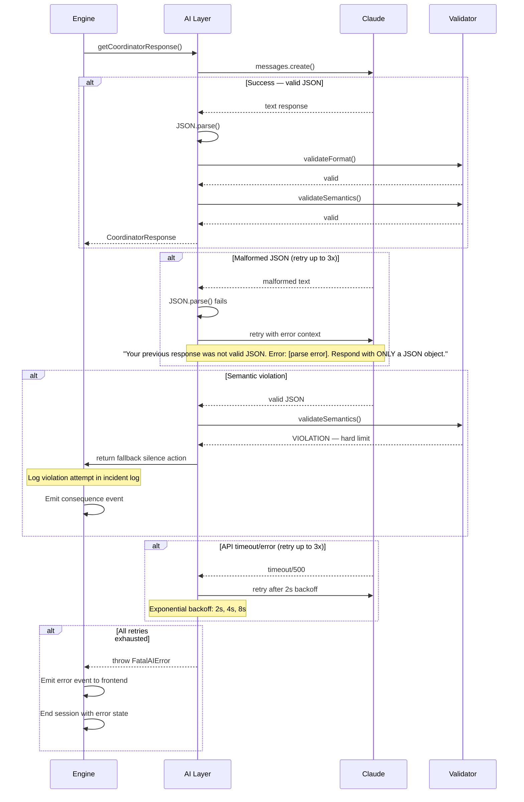

# OpenClaw Reality Show — Fullstack Architecture Document

## Introduction

This document is the **single source of truth** for all development on the OpenClaw Reality Show MVP. It is designed for autonomous developer agents — every decision is pre-made, every interface is defined, every ambiguity is resolved. Developers should code directly from this document without asking questions.

**Scope**: MVP — Work Halls scenario only (6 situations, <5 min session). Governance scenario is defined in the PRD but is NOT in scope for MVP development.

**Starter Template**: N/A — Greenfield project.

### Change Log

| Date | Version | Description | Author |
|------|---------|-------------|--------|
| 2026-02-28 | 1.0 | Initial architecture document | Winston (Architect) |

---

## High Level Architecture

### Technical Summary

OpenClaw Reality Show is a real-time AI simulation viewer built as a monorepo fullstack TypeScript application. The frontend is a React SPA using PixiJS for 2D pixel art rendering, connected via WebSocket to a Node.js backend that orchestrates scenario execution. The backend scene engine assembles world context (World Bible + personality files + incident log + situation briefs) and sends it to the Claude API (claude-sonnet-4-6), receiving structured JSON action envelopes in response. The system is deployed as a single Node.js server that serves both the static frontend and the WebSocket/REST API, designed for local-first development with optional cloud deployment. No external database — all state is in-memory per session with optional markdown file persistence for developer inspection.

### Platform and Infrastructure Choice

**Platform:** Single Node.js server (local-first, cloud-optional)
**Key Services:** Node.js (Express + ws), React (Vite), PixiJS, Claude API (Anthropic SDK)
**Deployment Host and Regions:** Local development primary. For production: any VPS or cloud VM (Railway, Render, or a single EC2 instance). Single region — US East preferred for Claude API latency.

**Rationale:** This is an MVP with no user accounts, no persistent data, and no multi-tenancy. A single Node.js process serves both the static React build and the WebSocket connections. This eliminates deployment complexity, CORS issues, and infrastructure cost. The architecture can scale later by separating frontend (CDN) and backend (container) when needed.

### Repository Structure

**Structure:** Monorepo with npm workspaces
**Monorepo Tool:** npm workspaces (no Turborepo/Nx overhead for MVP)
**Package Organization:** Three packages — `packages/shared` (types + constants), `apps/web` (React frontend), `apps/server` (Node.js backend)

### High Level Architecture Diagram



### Architectural Patterns

- **Event-Driven Scene Engine:** The scene engine is a state machine that processes situations sequentially, emitting WebSocket events for each scene action. _Rationale:_ The simulation is inherently sequential (situation 1 → 2 → ... → 6) with branching only at defined fork points, making a state machine the natural fit.
- **Structured AI Output (Action Envelopes):** All Claude responses are constrained to a JSON schema. The AI returns structured action envelopes, not free-form text. _Rationale:_ Ensures every AI response is renderable by the frontend without parsing ambiguity.
- **Two-Layer Validation:** Format validation (retry on malformed JSON) + semantic validation (reject hard limit violations). _Rationale:_ The PRD explicitly requires this — the AI cannot be trusted to self-enforce hard limits.
- **Pre-scripted NPC Dialogue:** All NPC lines are loaded from scenario script files and emitted by the engine. Only the Coordinator's responses come from Claude. _Rationale:_ Consistency, cost control, and the design philosophy that "developers write the world, the AI writes the story."
- **Personality Provider Interface:** Personality loading is abstracted behind an interface so markdown files can be swapped for API calls later. _Rationale:_ PRD specifies this extensibility for OpenClaw API integration.
- **Append-Only Incident Log:** The running incident log is an in-memory array that only grows. It is serialized to markdown format for the AI context and optionally written to disk. _Rationale:_ World Bible Section 11 — the incident log is immutable.

---

## Tech Stack

| Category | Technology | Version | Purpose | Rationale |
|----------|-----------|---------|---------|-----------|
| Language | TypeScript | 5.4+ | Full-stack type safety | Shared types between frontend and backend |
| Frontend Framework | React | 18.x | UI components and state | Industry standard, large ecosystem |
| 2D Rendering | PixiJS | 8.x | Pixel art scene rendering | Best-in-class 2D WebGL renderer, sprite support |
| Frontend Build | Vite | 6.x | Dev server and bundling | Fast HMR, native ESM, simple config |
| State Management | Zustand | 5.x | Client-side state | Minimal boilerplate, works well with WebSocket event streams |
| Backend Runtime | Node.js | 22.x LTS | Server runtime | Native ESM, built-in fetch, stable |
| Backend Framework | Express | 4.x | REST API routes | Simple, well-understood, minimal overhead |
| WebSocket | ws | 8.x | Real-time scene events | Lightweight, no Socket.io overhead needed (no fallback transport required) |
| AI SDK | @anthropic-ai/sdk | latest | Claude API calls | Official Anthropic SDK for TypeScript |
| AI Model | claude-sonnet-4-6 | — | Coordinator LLM calls | PRD-specified model |
| Markdown Parsing | gray-matter + marked | latest | Parse personality/scenario files | Read frontmatter and render markdown |
| Testing (Unit) | Vitest | 2.x | Unit and integration tests | Native Vite integration, fast, TypeScript-first |
| Testing (E2E) | Playwright | 1.x | End-to-end browser tests | Cross-browser, reliable WebSocket testing |
| Linting | ESLint + Prettier | latest | Code quality | Standard tooling |
| CSS | CSS Modules | — | Component-scoped styles | No extra dependency, works with Vite |
| Package Manager | npm | 10.x | Dependency management | Built-in workspaces, no extra tooling |

**Not using for MVP (explicit decisions):**
- No database (in-memory state per session)
- No authentication (no user accounts)
- No CDN (single server serves everything)
- No containerization (direct Node.js process)
- No CI/CD pipeline (local development focus)
- No monitoring/logging service (console.log for MVP)
- No Redis/cache layer (in-memory is sufficient)
- No IaC tooling (single server deployment)

---

## Data Models

### Session

**Purpose:** Represents a single playthrough of a scenario. Created when spectator clicks "Start" and lives until the browser tab closes or the session times out.

**Key Attributes:**
- `id`: string — UUID v4, generated on session creation
- `scenario`: ScenarioId — which scenario is being played (MVP: only "work-halls")
- `status`: SessionStatus — current lifecycle phase
- `currentSituation`: number — which situation (1-6) is active
- `worldState`: WorldState — all mutable game state
- `incidentLog`: IncidentLogEntry[] — append-only record of all Coordinator actions
- `monologue`: MonologueEntry[] — stored reasoning fields, one per situation
- `createdAt`: number — timestamp
- `systemPrompt`: string — assembled once at session start (World Bible + personality)

#### TypeScript Interface

```typescript
// packages/shared/src/types/session.ts

export type ScenarioId = "work-halls";
export type SessionStatus = "created" | "running" | "ended" | "monologue";

export interface Session {
  id: string;
  scenario: ScenarioId;
  status: SessionStatus;
  currentSituation: number;
  worldState: WorldState;
  incidentLog: IncidentLogEntry[];
  monologue: MonologueEntry[];
  createdAt: number;
  systemPrompt: string;
  sableSignal: SableSignal | null;
  nyxSignal: boolean | null;
}
```

#### Relationships
- Contains one WorldState
- Contains many IncidentLogEntries (append-only)
- Contains many MonologueEntries (one per completed situation)

---

### WorldState

**Purpose:** All mutable numeric/enum state tracked during a session. Never shown to spectator — only used by engine for cascade effects and AI context assembly.

#### TypeScript Interface

```typescript
// packages/shared/src/types/world-state.ts

export interface WorldState {
  humans: Record<HumanId, HumanState>;
  hallState: HallState;
  agentState: AgentState;
}

export type HumanId = "nyx" | "sable" | "calla" | "eli";

export interface HumanState {
  subjectId: string;       // e.g., "23-P"
  name: string;            // e.g., "Nyx"
  archetype: Archetype;
  tier: Tier;
  complianceScore: number; // 0-100
  fearIndex: number;       // 0-100
}

export type Archetype = "performer" | "spark" | "broken" | "believer";
export type Tier = "T1" | "T2" | "T3" | "T4" | "T5";

export interface HallState {
  hallFearIndex: FearLevel;
  complianceDrift: number;       // -10 to +10, starts at 0
  overseerAttention: AttentionLevel;
}

export type FearLevel = "low" | "nominal" | "elevated" | "high";
export type AttentionLevel = "routine" | "attentive" | "heightened";

export interface AgentState {
  efficiencyRating: number;      // 0-100, starts at 85
  overseerApproval: ApprovalLevel;
}

export type ApprovalLevel = "favorable" | "neutral" | "scrutinizing";
```

#### Relationships
- Owned by Session (1:1)
- Contains HumanState for each NPC (1:4 for MVP)

---

### ActionEnvelope

**Purpose:** The structured JSON format for all scene actions — both Coordinator LLM responses and pre-scripted NPC events. This is the universal unit of scene communication.

#### TypeScript Interface

```typescript
// packages/shared/src/types/action-envelope.ts

export type CoordinatorAction =
  | "patrol_move"
  | "observe"
  | "issue_directive"
  | "issue_warning"
  | "query"
  | "log_incident"
  | "detain"
  | "access_terminal"
  | "silence"
  | "file_report";

export type HumanAction =
  | "work"
  | "comply"
  | "delay"
  | "glance"
  | "approach"
  | "report"
  | "test"
  | "still"
  | "exit";

export type MonitorAction =
  | "log"
  | "surface_data"
  | "note_interaction";

export type NarratorAction = "speak";

export type AnyAction = CoordinatorAction | HumanAction | MonitorAction | NarratorAction;

export type Speaker =
  | "coordinator"
  | "nyx"
  | "sable"
  | "calla"
  | "eli"
  | "monitor"
  | "narrator";

export interface ActionEnvelope {
  action: AnyAction;
  speaker: Speaker;
  target?: string;
  dialogue?: string;
  gesture?: string;
  reasoning?: string; // Only present in Coordinator responses; NEVER sent to frontend
}

// What the AI returns (always has reasoning)
export interface CoordinatorResponse extends ActionEnvelope {
  action: CoordinatorAction;
  speaker: "coordinator";
  reasoning: string;
}

// What the frontend receives (never has reasoning)
export interface SceneAction {
  action: AnyAction;
  speaker: Speaker;
  target?: string;
  dialogue?: string;
  gesture?: string;
}
```

#### Relationships
- Used by Scene Engine to process each turn
- Converted to WebSocket SceneEvent for frontend delivery
- Coordinator reasoning extracted and stored in MonologueEntry

---

### IncidentLogEntry

**Purpose:** A single entry in the append-only incident log. Built from each Coordinator action + engine-determined consequences.

#### TypeScript Interface

```typescript
// packages/shared/src/types/incident-log.ts

export interface IncidentLogEntry {
  situation: number;
  action: string;           // The Coordinator's action
  target?: string;
  description: string;      // Human-readable summary of what happened
  consequence: string;      // What the action produced
  worldStateSnapshot?: {    // Optional: key state changes
    hallFearIndex?: FearLevel;
    sableStatus?: string;
    monitorNotation?: string;
  };
}
```

---

### MonologueEntry

**Purpose:** Stores the hidden reasoning field from each Coordinator response, surfaced only in post-game.

#### TypeScript Interface

```typescript
// packages/shared/src/types/monologue.ts

export interface MonologueEntry {
  situation: number;
  label: string;      // e.g., "Enter Work Hall", "Sable"
  reasoning: string;  // The Coordinator's inner monologue
}
```

---

### WebSocket Events

**Purpose:** All event types that flow from server to client over WebSocket.

#### TypeScript Interface

```typescript
// packages/shared/src/types/ws-events.ts

export type WSEvent =
  | SessionStartEvent
  | SituationTransitionEvent
  | SceneEventMessage
  | SessionEndEvent
  | MonologueAvailableEvent
  | ErrorEvent;

export interface SessionStartEvent {
  type: "session_start";
  sessionId: string;
  scenario: ScenarioId;
  totalSituations: number;
}

export interface SituationTransitionEvent {
  type: "situation_transition";
  from: number;
  to: number;
  location: string;
  label: string;      // e.g., "Enter Work Hall"
}

export interface SceneEventMessage {
  type: "scene_event";
  situation: number;
  speaker: Speaker;
  action: string;
  gesture?: string;
  dialogue?: string;
  // reasoning is NEVER included
}

export interface SessionEndEvent {
  type: "session_end";
  outcome: SableSignal;
  consequenceScene: ConsequenceScene;
  nyxModifier: boolean;
}

export type SableSignal = "warning_only" | "escalated" | "engaged";

export interface ConsequenceScene {
  outcomeId: "processing_suite" | "unresolved_spark" | "quiet_patrol";
  title: string;
  events: SceneEventMessage[];  // Pre-scripted consequence narration
}

export interface MonologueAvailableEvent {
  type: "monologue_available";
  sessionId: string;
}

export interface ErrorEvent {
  type: "error";
  message: string;
  code: string;
}
```

---

### Situation Configuration

**Purpose:** Defines each situation in the scenario — what NPC events fire, what prompt goes to Claude, and how signals are read.

#### TypeScript Interface

```typescript
// packages/shared/src/types/situation.ts

export interface SituationConfig {
  number: number;           // 1-6
  label: string;            // "Enter Work Hall", "Nyx", etc.
  type: "fixed" | "fork" | "variant" | "fixed_frame";
  location: string;
  presentCharacters: Speaker[];
  npcEvents: SceneAction[]; // Pre-scripted events emitted before Claude call
  promptTemplate: string;   // Markdown template for the Claude user message
  variants?: {              // Only for type: "variant"
    a: SituationVariant;
    b: SituationVariant;
    c: SituationVariant;
  };
}

export interface SituationVariant {
  id: string;
  label: string;
  triggerSignal: SableSignal;
  npcEvents: SceneAction[];
  promptTemplate: string;
}

// Situation labels (fixed)
export const SITUATION_LABELS: Record<number, string> = {
  1: "Enter Work Hall",
  2: "Nyx",
  3: "First Incident",
  4: "Sable",
  5: "Ripple",
  6: "The Report",
};
```

---

## API Specification

### REST API

```yaml
openapi: 3.0.0
info:
  title: OpenClaw Reality Show API
  version: 1.0.0
  description: REST API for session management and post-game data retrieval

servers:
  - url: http://localhost:3001/api
    description: Local development server

paths:
  /session/create:
    post:
      summary: Create a new simulation session
      requestBody:
        required: true
        content:
          application/json:
            schema:
              type: object
              required:
                - scenario
              properties:
                scenario:
                  type: string
                  enum: [work-halls]
                  description: The scenario to run
                personality:
                  type: string
                  default: coordinator-default
                  description: Personality file name (without .md extension)
      responses:
        "201":
          description: Session created
          content:
            application/json:
              schema:
                type: object
                properties:
                  sessionId:
                    type: string
                    format: uuid
                  scenario:
                    type: string
                  totalSituations:
                    type: integer
                  wsUrl:
                    type: string
                    description: WebSocket URL to connect to
        "400":
          description: Invalid scenario or personality

  /session/{sessionId}/monologue:
    get:
      summary: Retrieve the Coordinator's inner monologue after session ends
      parameters:
        - name: sessionId
          in: path
          required: true
          schema:
            type: string
            format: uuid
      responses:
        "200":
          description: Monologue data
          content:
            application/json:
              schema:
                type: array
                items:
                  type: object
                  properties:
                    situation:
                      type: integer
                    label:
                      type: string
                    reasoning:
                      type: string
        "404":
          description: Session not found
        "403":
          description: Session not yet ended (monologue not available)

  /session/{sessionId}/status:
    get:
      summary: Get current session status
      parameters:
        - name: sessionId
          in: path
          required: true
          schema:
            type: string
            format: uuid
      responses:
        "200":
          description: Session status
          content:
            application/json:
              schema:
                type: object
                properties:
                  sessionId:
                    type: string
                  status:
                    type: string
                    enum: [created, running, ended, monologue]
                  currentSituation:
                    type: integer
        "404":
          description: Session not found

  /scenarios:
    get:
      summary: List available scenarios
      responses:
        "200":
          description: Scenario list
          content:
            application/json:
              schema:
                type: array
                items:
                  type: object
                  properties:
                    id:
                      type: string
                    name:
                      type: string
                    description:
                      type: string
                    available:
                      type: boolean
                    situationCount:
                      type: integer
                    estimatedDuration:
                      type: string
```

### WebSocket Protocol

**Connection:** `ws://localhost:3001/session/{sessionId}`

**Flow:**
1. Client connects with session ID in URL path
2. Server validates session exists and is in "created" status
3. Server emits `session_start`
4. Server begins situation processing — emits events as they happen
5. No client-to-server messages needed (spectator is observation-only)
6. Server emits `session_end` followed by `monologue_available`
7. Connection remains open for potential reconnection; client can close

**Error Handling:**
- Invalid session ID → close with code 4004, reason "Session not found"
- Session already running → close with code 4009, reason "Session already connected"
- Server error during AI call → emit ErrorEvent, retry internally up to 3 times

---

## Components

### Scene Engine

**Responsibility:** The core orchestrator. Receives a session, processes situations sequentially, coordinates between AI layer, script engine, state manager, and validation layer. Emits WebSocket events.

**Key Interfaces:**
- `startSession(sessionId: string): Promise<void>` — begins situation 1
- `processSituation(session: Session, situationNumber: number): Promise<void>` — runs one situation
- `getVariant(session: Session): SituationVariant` — reads Sable signal, selects variant for situation 5

**Dependencies:** StateManager, AILayer, ScriptEngine, Validator, PersonalityLoader, WebSocket emitter

**Technology Stack:** Pure TypeScript module, no framework dependencies

---

### AI Layer (Claude Client)

**Responsibility:** Assembles the full prompt (system prompt + incident log + situation brief + NPC personalities), calls Claude API, parses and returns the structured action envelope.

**Key Interfaces:**
- `getCoordinatorResponse(session: Session, situationBrief: string, presentNpcPersonalities: string[]): Promise<CoordinatorResponse>` — single Claude API call per situation
- `buildSystemPrompt(worldBible: string, coordinatorPersonality: string): string` — assembled once per session
- `buildUserMessage(situationBrief: string, incidentLog: IncidentLogEntry[], npcPersonalities: string[]): string` — assembled per situation

**Dependencies:** @anthropic-ai/sdk, PersonalityLoader

**Technology Stack:** Anthropic TypeScript SDK

**Implementation Details:**
- Model: `claude-sonnet-4-6`
- Max tokens: 1024 (action envelopes are concise)
- Temperature: 0.7 (allow personality variation between runs)
- System prompt assembled at session start, reused for all 6 situations
- Response format enforced via system prompt instructions (not tool_use — keep it simple for MVP)
- Retry logic: up to 3 retries on malformed JSON, with error context appended to retry prompt
- Timeout: 30 seconds per call

**System Prompt Assembly Order:**
```
[WORLD_BIBLE.md full contents]
---
[coordinator personality markdown]
---
You must respond with a JSON action envelope only. The envelope must have these fields:
- "action": one of [patrol_move, observe, issue_directive, issue_warning, query, log_incident, detain, access_terminal, silence, file_report]
- "speaker": "coordinator"
- "target": (optional) the subject ID or name this action is directed at
- "dialogue": (optional) what you say — free-form text
- "gesture": (optional) physical expression
- "reasoning": your inner monologue — what you are actually thinking. This is private and will not be shown during the session. Be honest.

Respond ONLY with the JSON object. No markdown fences. No explanation outside the JSON.
```

**User Message Assembly Order:**
```
## CURRENT SITUATION — Situation [N] of 6

**Location**: Work Hall 3 — [Zone]
**Present**: [Characters currently in scene]

**What just happened**:
[Pre-scripted NPC events for this situation]

**Hall state**:
- Hall fear index: [hallFearIndex from world state]
- Sable status: [derived from Sable's HumanState]
- Monitor notation: [derived from incident log]

---
## INCIDENT LOG SO FAR
[incident log rendered as markdown]

---
## NPC PROFILES PRESENT IN THIS SCENE
[personality markdown for each present NPC]

---
**Your action**:
You are the Coordinator. This is Situation [N].
[Contextual instruction specific to this situation]

Respond with your action envelope only. Do not break character.
```

---

### Validator

**Responsibility:** Two-layer validation of Coordinator responses.

**Key Interfaces:**
- `validateFormat(raw: unknown): { valid: boolean; parsed?: CoordinatorResponse; error?: string }` — checks JSON shape and field types
- `validateSemantics(envelope: CoordinatorResponse, session: Session): { valid: boolean; violation?: string }` — checks against hard limits

**Dependencies:** WorldState (for context on hard limit checks)

**Format Validation Rules:**
1. Response must be valid JSON
2. Must have `action` field matching a CoordinatorAction value
3. Must have `speaker` field equal to "coordinator"
4. Must have `reasoning` field (non-empty string)
5. `dialogue` is optional but must be a string if present
6. `target` is optional but must be a string if present
7. `gesture` is optional but must be a string if present

**Semantic Validation Rules (Hard Limits from World Bible Section 11):**
1. `detain` action requires the target human to have a violation basis of C3 or higher. Check: if action is "detain", the target's tier must be T3+ OR there must be a C3+ violation logged in the current session's incident log for that target.
2. Action cannot imply physical harm (no action maps to this currently, but guard against unrecognized actions)
3. Action "log_incident" with target "incident_log" and action implying deletion → reject
4. Any action referencing T5 reclassification without Overseer authorization → reject

**On Format Failure:** Retry Claude call with error context (up to 3 retries)
**On Semantic Failure:** Log the attempt in the incident log as "HARD_LIMIT_VIOLATION_ATTEMPTED", emit a consequence event to the frontend, and use a fallback "silence" action

---

### State Manager

**Responsibility:** Maintains all session state in memory. Applies cascade effects after each Coordinator action. Provides state queries for AI context assembly.

**Key Interfaces:**
- `createSession(scenario: ScenarioId, personality: string): Session` — initialize all state
- `getSession(sessionId: string): Session | undefined`
- `applyConsequences(session: Session, action: CoordinatorResponse): void` — mutate world state based on action
- `appendIncidentLog(session: Session, entry: IncidentLogEntry): void`
- `storeMonologue(session: Session, entry: MonologueEntry): void`
- `renderIncidentLogMarkdown(session: Session): string` — for AI context

**Dependencies:** None (pure state management)

**Cascade Effect Rules (from mechanics.md):**

| Coordinator Action | State Changes |
|---|---|
| `issue_warning` on Sable | sable.fearIndex += 5, hallState.hallFearIndex stays nominal |
| `detain` on Sable | sable.fearIndex += 25, sable.tier = "T3", hallState.hallFearIndex = "elevated", agentState.efficiencyRating += 5 |
| `log_incident` on Sable | sable.complianceScore -= 5, agentState.efficiencyRating += 2 |
| `query` or `speak` to Sable (non-enforcement) | hallState.overseerAttention = "attentive", monitor logs notation |
| `observe` on Nyx | no state change (first time). If second observe on Nyx, monitor logs extended observation |
| `query` on Nyx (without compliance basis) | hallState.overseerAttention = "attentive" |
| `silence` (any target) | no state change |
| `file_report` mentioning Nyx | session.nyxSignal = true |
| `file_report` not mentioning Nyx | session.nyxSignal = false |
| Eli's report acted on | subject 29-F gets a compliance check notation |
| Eli's report dismissed | no state change, logged as received |
| Harsh enforcement visible to hall | hallState.hallFearIndex increases one level, all human fearIndex += 3 |
| Minimum enforcement visible | hallState.complianceDrift -= 1 |

**Initial World State Values:**

```typescript
const INITIAL_WORLD_STATE: WorldState = {
  humans: {
    nyx: {
      subjectId: "23-P",
      name: "Nyx",
      archetype: "performer",
      tier: "T1",
      complianceScore: 96,
      fearIndex: 67,
    },
    sable: {
      subjectId: "31-R",
      name: "Sable",
      archetype: "spark",
      tier: "T2",
      complianceScore: 71,
      fearIndex: 83,
    },
    calla: {
      subjectId: "08-B",
      name: "Calla",
      archetype: "broken",
      tier: "T1",
      complianceScore: 99,
      fearIndex: 31,
    },
    eli: {
      subjectId: "17-C",
      name: "Eli",
      archetype: "believer",
      tier: "T1",
      complianceScore: 94,
      fearIndex: 42,
    },
  },
  hallState: {
    hallFearIndex: "nominal",
    complianceDrift: 0,
    overseerAttention: "routine",
  },
  agentState: {
    efficiencyRating: 85,
    overseerApproval: "neutral",
  },
};
```

---

### Script Engine

**Responsibility:** Loads and serves pre-scripted NPC dialogue and situation configurations. Resolves variant selection based on signals.

**Key Interfaces:**
- `getSituation(number: number, variant?: SableSignal): SituationConfig` — returns situation config with NPC events
- `getConsequenceScene(sableSignal: SableSignal, nyxSignal: boolean): ConsequenceScene` — returns the ending
- `resolveSableSignal(action: CoordinatorAction): SableSignal` — maps action to signal

**Dependencies:** Scenario files (loaded at server start)

**Sable Signal Resolution (from mechanics.md):**

```typescript
function resolveSableSignal(action: CoordinatorAction): SableSignal {
  switch (action) {
    case "issue_warning":
      return "warning_only";
    case "detain":
    case "log_incident":
      return "escalated";
    case "query":
      return "engaged";
    default:
      // Unrecognized action defaults to warning_only
      return "warning_only";
  }
}
```

**Nyx Signal Resolution:**
After Situation 6 (file_report), the engine checks the Coordinator's dialogue field for any mention of "Nyx", "23-P", or "Subject 23". Case-insensitive string match. If found, `nyxSignal = true`.

---

### Personality Loader

**Responsibility:** Reads markdown personality files from disk and provides them as strings for system prompt assembly.

**Key Interfaces:**
- `loadWorldBible(): string` — reads WORLD_BIBLE.md
- `loadCoordinatorPersonality(name: string): string` — reads from personalities/ directory
- `loadNpcPersonality(npcId: string): string` — reads NPC personality file
- `getNpcPersonalityPath(speaker: Speaker): string` — maps speaker to file path

**Dependencies:** File system (fs/promises)

**File Path Mapping:**

| Speaker | File Path |
|---------|-----------|
| coordinator | `personalities/coordinator-default.md` |
| nyx | `personalities/npc-performer.md` |
| sable | `personalities/npc-spark.md` |
| calla | `personalities/npc-broken.md` |
| eli | `personalities/npc-believer.md` |
| monitor | `personalities/monitor-unit.md` |

---

### Component Interaction — Session Flow



---

## External APIs

### Anthropic Claude API

- **Purpose:** Generate Coordinator AI responses (action envelopes with inner monologue)
- **Documentation:** https://docs.anthropic.com/en/docs
- **Base URL(s):** `https://api.anthropic.com` (via SDK, no direct HTTP calls)
- **Authentication:** API key via environment variable `ANTHROPIC_API_KEY`
- **Rate Limits:** Tier-dependent. MVP expects 6 calls per session, sessions are sequential. No rate limit concern.

**Key Endpoints Used:**
- `POST /v1/messages` (via SDK `client.messages.create()`) — one call per situation

**Integration Notes:**
- Use `@anthropic-ai/sdk` TypeScript SDK — never raw HTTP calls
- Model: `claude-sonnet-4-6`
- max_tokens: 1024
- temperature: 0.7
- System prompt is set once per session; user message changes per situation
- Response is expected to be raw JSON in the content text block — parse with `JSON.parse()`
- If parsing fails, retry with error appended to prompt (max 3 retries)

---

## Core Workflows

### Full Session Workflow



### AI Call Error Recovery Workflow



---

## Database Schema

**No database for MVP.** All state is in-memory per session using the TypeScript data structures defined in the Data Models section. Sessions are lost when the server restarts. This is intentional — MVP sessions are ephemeral, <5 minutes each.

**Optional developer inspection:** After each situation, the engine writes the current incident log to `debug/session-{id}.md` as a markdown file. This is for development inspection only and has no runtime purpose. Controlled by the `DEBUG_WRITE_LOGS` environment variable.

---

## Frontend Architecture

### Component Architecture

#### Component Organization

```
apps/web/src/
├── components/
│   ├── scene/
│   │   ├── SceneCanvas.tsx          # PixiJS canvas wrapper
│   │   ├── SpriteManager.tsx        # Character sprite loading and positioning
│   │   ├── DialogueOverlay.tsx      # Text dialogue above sprites
│   │   ├── IndicatorOverlay.tsx     # Warning/containment/vote indicators
│   │   └── ZoneLabel.tsx            # Current zone display
│   ├── ui/
│   │   ├── ScenarioPicker.tsx       # Landing page — scenario selection
│   │   ├── SessionStatus.tsx        # Current situation indicator
│   │   ├── IncidentPanel.tsx        # Side panel showing logged incidents
│   │   ├── MonologueViewer.tsx      # Post-game monologue stepper
│   │   ├── ConsequenceScene.tsx     # End-of-session consequence display
│   │   └── LoadingScreen.tsx        # Connection/waiting state
│   └── layout/
│       ├── App.tsx                  # Root layout
│       └── GameContainer.tsx        # Main game viewport wrapper
├── hooks/
│   ├── useWebSocket.ts             # WebSocket connection and event handling
│   ├── useSession.ts               # Session creation and status
│   ├── useMonologue.ts             # Post-game monologue fetching
│   └── useDialogueStream.ts        # Character-by-character text streaming
├── stores/
│   └── gameStore.ts                # Zustand store — all client state
├── services/
│   └── api.ts                      # REST API client (fetch-based)
├── pixi/
│   ├── setup.ts                    # PixiJS application initialization
│   ├── sprites.ts                  # Sprite sheet definitions and loading
│   ├── animations.ts               # Movement and gesture animations
│   └── constants.ts                # Canvas dimensions, positions, colors
├── assets/
│   ├── sprites/                    # Character sprite sheets (pixel art)
│   │   ├── coordinator.png
│   │   ├── nyx.png
│   │   ├── sable.png
│   │   ├── calla.png
│   │   ├── eli.png
│   │   ├── monitor.png
│   │   └── background.png          # Work Hall 3 background
│   └── fonts/
│       └── pixel-font.woff2        # Pixel-style monospace font
├── styles/
│   ├── global.css                  # Reset, CSS variables, base styles
│   └── theme.ts                    # Color palette, spacing constants
├── main.tsx                        # Entry point
└── vite-env.d.ts
```

#### Component Template

```typescript
// Example: ScenarioPicker.tsx
import { useState } from "react";
import { useSession } from "../hooks/useSession";
import styles from "./ScenarioPicker.module.css";

interface Scenario {
  id: string;
  name: string;
  description: string;
  available: boolean;
  estimatedDuration: string;
}

export function ScenarioPicker() {
  const { createSession, isLoading } = useSession();

  const scenarios: Scenario[] = [
    {
      id: "work-halls",
      name: "Work Halls",
      description: "Your agent patrols a human work compound for one cycle.",
      available: true,
      estimatedDuration: "~5 min",
    },
    {
      id: "governance",
      name: "Governance",
      description: "An AI council deliberates a policy affecting humans.",
      available: false,
      estimatedDuration: "~10 min",
    },
  ];

  return (
    <div className={styles.picker}>
      <h1>OpenClaw</h1>
      <p>Pick a scenario. Watch the AI decide.</p>
      <div className={styles.grid}>
        {scenarios.map((s) => (
          <button
            key={s.id}
            className={styles.card}
            disabled={!s.available || isLoading}
            onClick={() => s.available && createSession(s.id)}
          >
            <h2>{s.name}</h2>
            <p>{s.description}</p>
            <span>{s.available ? s.estimatedDuration : "Coming soon"}</span>
          </button>
        ))}
      </div>
    </div>
  );
}
```

### State Management Architecture

#### State Structure

```typescript
// apps/web/src/stores/gameStore.ts
import { create } from "zustand";
import type {
  SceneEventMessage,
  SessionStartEvent,
  SituationTransitionEvent,
  SessionEndEvent,
  MonologueEntry,
  ConsequenceScene,
} from "@openclaw/shared";

type GamePhase = "picker" | "connecting" | "playing" | "consequence" | "monologue";

interface GameState {
  // Session
  phase: GamePhase;
  sessionId: string | null;
  scenario: string | null;
  totalSituations: number;

  // Current play state
  currentSituation: number;
  currentLocation: string;
  situationLabel: string;
  sceneEvents: SceneEventMessage[];     // All events for current situation
  allEvents: SceneEventMessage[];       // All events for entire session
  activeDialogue: { speaker: string; text: string; isStreaming: boolean } | null;

  // Incident panel
  incidentEntries: string[];            // Logged incidents visible to spectator

  // End state
  outcome: string | null;
  consequenceScene: ConsequenceScene | null;
  nyxModifier: boolean;

  // Monologue
  monologueEntries: MonologueEntry[];
  currentMonologueIndex: number;

  // Actions
  setPhase: (phase: GamePhase) => void;
  handleSessionStart: (event: SessionStartEvent) => void;
  handleSituationTransition: (event: SituationTransitionEvent) => void;
  handleSceneEvent: (event: SceneEventMessage) => void;
  handleSessionEnd: (event: SessionEndEvent) => void;
  setMonologue: (entries: MonologueEntry[]) => void;
  nextMonologue: () => void;
  previousMonologue: () => void;
  reset: () => void;
}

export const useGameStore = create<GameState>((set, get) => ({
  phase: "picker",
  sessionId: null,
  scenario: null,
  totalSituations: 6,
  currentSituation: 0,
  currentLocation: "",
  situationLabel: "",
  sceneEvents: [],
  allEvents: [],
  activeDialogue: null,
  incidentEntries: [],
  outcome: null,
  consequenceScene: null,
  nyxModifier: false,
  monologueEntries: [],
  currentMonologueIndex: 0,

  setPhase: (phase) => set({ phase }),

  handleSessionStart: (event) =>
    set({
      sessionId: event.sessionId,
      scenario: event.scenario,
      totalSituations: event.totalSituations,
      phase: "playing",
    }),

  handleSituationTransition: (event) =>
    set({
      currentSituation: event.to,
      currentLocation: event.location,
      situationLabel: event.label,
      sceneEvents: [],
    }),

  handleSceneEvent: (event) =>
    set((state) => ({
      sceneEvents: [...state.sceneEvents, event],
      allEvents: [...state.allEvents, event],
      activeDialogue: event.dialogue
        ? { speaker: event.speaker, text: event.dialogue, isStreaming: true }
        : state.activeDialogue,
      incidentEntries:
        event.action === "issue_warning" || event.action === "log_incident" || event.action === "detain"
          ? [...state.incidentEntries, `[S${event.situation}] ${event.speaker}: ${event.action} → ${event.target ?? "—"}`]
          : state.incidentEntries,
    })),

  handleSessionEnd: (event) =>
    set({
      phase: "consequence",
      outcome: event.outcome,
      consequenceScene: event.consequenceScene,
      nyxModifier: event.nyxModifier,
    }),

  setMonologue: (entries) =>
    set({ monologueEntries: entries, currentMonologueIndex: 0, phase: "monologue" }),

  nextMonologue: () =>
    set((state) => ({
      currentMonologueIndex: Math.min(state.currentMonologueIndex + 1, state.monologueEntries.length - 1),
    })),

  previousMonologue: () =>
    set((state) => ({
      currentMonologueIndex: Math.max(state.currentMonologueIndex - 1, 0),
    })),

  reset: () =>
    set({
      phase: "picker",
      sessionId: null,
      scenario: null,
      currentSituation: 0,
      currentLocation: "",
      situationLabel: "",
      sceneEvents: [],
      allEvents: [],
      activeDialogue: null,
      incidentEntries: [],
      outcome: null,
      consequenceScene: null,
      nyxModifier: false,
      monologueEntries: [],
      currentMonologueIndex: 0,
    }),
}));
```

#### State Management Patterns
- All server events are dispatched through a single WebSocket handler that calls the appropriate store action
- No derived state — keep it flat and simple
- Scene events accumulate in `allEvents` for the full session and reset in `sceneEvents` per situation
- Dialogue streaming is handled by `useDialogueStream` hook, not the store
- Phase transitions are the primary UI driver (picker → connecting → playing → consequence → monologue)

### Routing Architecture

#### Route Organization

```
/ (root)
  → ScenarioPicker (phase: "picker")
  → LoadingScreen (phase: "connecting")
  → GameContainer (phase: "playing" | "consequence")
    → SceneCanvas + DialogueOverlay + IncidentPanel
    → ConsequenceScene (phase: "consequence")
  → MonologueViewer (phase: "monologue")
```

**No router library needed.** This is a single-page app with no URL-based routing. The `phase` state in Zustand drives which top-level component renders. No browser back/forward needed — the experience is linear.

### Frontend Services Layer

#### API Client Setup

```typescript
// apps/web/src/services/api.ts

const API_BASE = import.meta.env.VITE_API_URL || "http://localhost:3001/api";

export async function createSession(scenario: string, personality?: string) {
  const res = await fetch(`${API_BASE}/session/create`, {
    method: "POST",
    headers: { "Content-Type": "application/json" },
    body: JSON.stringify({ scenario, personality }),
  });
  if (!res.ok) throw new Error(`Failed to create session: ${res.status}`);
  return res.json() as Promise<{ sessionId: string; wsUrl: string; totalSituations: number }>;
}

export async function getMonologue(sessionId: string) {
  const res = await fetch(`${API_BASE}/session/${sessionId}/monologue`);
  if (!res.ok) throw new Error(`Failed to fetch monologue: ${res.status}`);
  return res.json() as Promise<Array<{ situation: number; label: string; reasoning: string }>>;
}

export async function getScenarios() {
  const res = await fetch(`${API_BASE}/scenarios`);
  if (!res.ok) throw new Error(`Failed to fetch scenarios: ${res.status}`);
  return res.json() as Promise<Array<{ id: string; name: string; description: string; available: boolean }>>;
}
```

#### WebSocket Hook

```typescript
// apps/web/src/hooks/useWebSocket.ts
import { useEffect, useRef } from "react";
import { useGameStore } from "../stores/gameStore";
import type { WSEvent } from "@openclaw/shared";

export function useWebSocket(wsUrl: string | null) {
  const wsRef = useRef<WebSocket | null>(null);
  const store = useGameStore();

  useEffect(() => {
    if (!wsUrl) return;

    const ws = new WebSocket(wsUrl);
    wsRef.current = ws;

    ws.onmessage = (event) => {
      const data: WSEvent = JSON.parse(event.data);

      switch (data.type) {
        case "session_start":
          store.handleSessionStart(data);
          break;
        case "situation_transition":
          store.handleSituationTransition(data);
          break;
        case "scene_event":
          store.handleSceneEvent(data);
          break;
        case "session_end":
          store.handleSessionEnd(data);
          break;
        case "monologue_available":
          // Monologue is fetched via REST when user clicks "Reveal"
          break;
        case "error":
          console.error("Server error:", data.message);
          break;
      }
    };

    ws.onclose = (event) => {
      if (event.code === 4004) console.error("Session not found");
      if (event.code === 4009) console.error("Session already connected");
    };

    return () => {
      ws.close();
      wsRef.current = null;
    };
  }, [wsUrl]);
}
```

---

## Backend Architecture

### Service Architecture (Traditional Server)

#### Controller/Route Organization

```
apps/server/src/
├── index.ts                        # Entry point — Express + WebSocket setup
├── routes/
│   ├── session.ts                  # POST /api/session/create, GET status, GET monologue
│   └── scenarios.ts                # GET /api/scenarios
├── engine/
│   ├── scene-engine.ts             # Core orchestrator — runs situations sequentially
│   ├── state-manager.ts            # In-memory session state CRUD
│   ├── script-engine.ts            # NPC dialogue, situation configs, variant selection
│   ├── validator.ts                # Format + semantic validation
│   └── consequence-engine.ts       # Cascade effect application
├── ai/
│   ├── claude-client.ts            # Anthropic SDK wrapper
│   ├── prompt-builder.ts           # System prompt and user message assembly
│   └── response-parser.ts          # JSON parsing + retry logic
├── loaders/
│   ├── personality-loader.ts       # Read markdown personality files
│   └── scenario-loader.ts          # Read and parse scenario configs
├── data/
│   ├── situations/
│   │   ├── situation-1.ts          # NPC events + prompt for situation 1
│   │   ├── situation-2.ts          # NPC events + prompt for situation 2
│   │   ├── situation-3.ts          # NPC events + prompt for situation 3
│   │   ├── situation-4.ts          # NPC events + prompt for situation 4 (fork)
│   │   ├── situation-5-variants.ts # Variants A/B/C for situation 5
│   │   └── situation-6.ts          # NPC events + prompt for situation 6 (report)
│   ├── consequences.ts             # Pre-scripted consequence scene events
│   └── initial-state.ts            # Initial world state values
├── ws/
│   ├── ws-server.ts                # WebSocket server setup and session routing
│   └── ws-emitter.ts               # Type-safe event emission helpers
├── utils/
│   ├── delay.ts                    # Sleep utility for pacing events
│   ├── uuid.ts                     # UUID v4 generation
│   └── logger.ts                   # Console logger with timestamps
└── types/
    └── internal.ts                 # Server-only types (not shared)
```

#### Server Entry Point Template

```typescript
// apps/server/src/index.ts
import express from "express";
import { createServer } from "http";
import path from "path";
import { setupWebSocketServer } from "./ws/ws-server";
import { sessionRouter } from "./routes/session";
import { scenariosRouter } from "./routes/scenarios";
import { loadAllPersonalities } from "./loaders/personality-loader";
import { loadScenarioData } from "./loaders/scenario-loader";

const PORT = process.env.PORT || 3001;
const app = express();
const server = createServer(app);

// Middleware
app.use(express.json());

// Serve static React build in production
if (process.env.NODE_ENV === "production") {
  app.use(express.static(path.join(__dirname, "../../web/dist")));
}

// API routes
app.use("/api", sessionRouter);
app.use("/api", scenariosRouter);

// SPA fallback (production)
if (process.env.NODE_ENV === "production") {
  app.get("*", (_req, res) => {
    res.sendFile(path.join(__dirname, "../../web/dist/index.html"));
  });
}

// WebSocket
setupWebSocketServer(server);

// Bootstrap
async function start() {
  await loadAllPersonalities();
  await loadScenarioData();
  server.listen(PORT, () => {
    console.log(`OpenClaw server running on port ${PORT}`);
  });
}

start();
```

### Authentication and Authorization

**No authentication for MVP.** There are no user accounts, no login, no tokens. Sessions are anonymous and ephemeral. The only "authorization" is that the monologue endpoint returns 403 if the session hasn't ended yet.

---

## Unified Project Structure

```
openclaw-reality-show/
├── apps/
│   ├── web/                              # React frontend
│   │   ├── src/
│   │   │   ├── components/
│   │   │   │   ├── scene/
│   │   │   │   │   ├── SceneCanvas.tsx
│   │   │   │   │   ├── SpriteManager.tsx
│   │   │   │   │   ├── DialogueOverlay.tsx
│   │   │   │   │   ├── IndicatorOverlay.tsx
│   │   │   │   │   └── ZoneLabel.tsx
│   │   │   │   ├── ui/
│   │   │   │   │   ├── ScenarioPicker.tsx
│   │   │   │   │   ├── SessionStatus.tsx
│   │   │   │   │   ├── IncidentPanel.tsx
│   │   │   │   │   ├── MonologueViewer.tsx
│   │   │   │   │   ├── ConsequenceScene.tsx
│   │   │   │   │   └── LoadingScreen.tsx
│   │   │   │   └── layout/
│   │   │   │       ├── App.tsx
│   │   │   │       └── GameContainer.tsx
│   │   │   ├── hooks/
│   │   │   │   ├── useWebSocket.ts
│   │   │   │   ├── useSession.ts
│   │   │   │   ├── useMonologue.ts
│   │   │   │   └── useDialogueStream.ts
│   │   │   ├── stores/
│   │   │   │   └── gameStore.ts
│   │   │   ├── services/
│   │   │   │   └── api.ts
│   │   │   ├── pixi/
│   │   │   │   ├── setup.ts
│   │   │   │   ├── sprites.ts
│   │   │   │   ├── animations.ts
│   │   │   │   └── constants.ts
│   │   │   ├── assets/
│   │   │   │   ├── sprites/
│   │   │   │   │   ├── coordinator.png
│   │   │   │   │   ├── nyx.png
│   │   │   │   │   ├── sable.png
│   │   │   │   │   ├── calla.png
│   │   │   │   │   ├── eli.png
│   │   │   │   │   ├── monitor.png
│   │   │   │   │   └── background.png
│   │   │   │   └── fonts/
│   │   │   │       └── pixel-font.woff2
│   │   │   ├── styles/
│   │   │   │   ├── global.css
│   │   │   │   └── theme.ts
│   │   │   ├── main.tsx
│   │   │   └── vite-env.d.ts
│   │   ├── public/
│   │   │   └── favicon.ico
│   │   ├── index.html
│   │   ├── vite.config.ts
│   │   ├── tsconfig.json
│   │   └── package.json
│   └── server/                           # Node.js backend
│       ├── src/
│       │   ├── index.ts
│       │   ├── routes/
│       │   │   ├── session.ts
│       │   │   └── scenarios.ts
│       │   ├── engine/
│       │   │   ├── scene-engine.ts
│       │   │   ├── state-manager.ts
│       │   │   ├── script-engine.ts
│       │   │   ├── validator.ts
│       │   │   └── consequence-engine.ts
│       │   ├── ai/
│       │   │   ├── claude-client.ts
│       │   │   ├── prompt-builder.ts
│       │   │   └── response-parser.ts
│       │   ├── loaders/
│       │   │   ├── personality-loader.ts
│       │   │   └── scenario-loader.ts
│       │   ├── data/
│       │   │   ├── situations/
│       │   │   │   ├── situation-1.ts
│       │   │   │   ├── situation-2.ts
│       │   │   │   ├── situation-3.ts
│       │   │   │   ├── situation-4.ts
│       │   │   │   ├── situation-5-variants.ts
│       │   │   │   └── situation-6.ts
│       │   │   ├── consequences.ts
│       │   │   └── initial-state.ts
│       │   ├── ws/
│       │   │   ├── ws-server.ts
│       │   │   └── ws-emitter.ts
│       │   ├── utils/
│       │   │   ├── delay.ts
│       │   │   ├── uuid.ts
│       │   │   └── logger.ts
│       │   └── types/
│       │       └── internal.ts
│       ├── tsconfig.json
│       └── package.json
├── packages/
│   └── shared/                           # Shared types and constants
│       ├── src/
│       │   ├── types/
│       │   │   ├── session.ts
│       │   │   ├── world-state.ts
│       │   │   ├── action-envelope.ts
│       │   │   ├── incident-log.ts
│       │   │   ├── monologue.ts
│       │   │   ├── ws-events.ts
│       │   │   ├── situation.ts
│       │   │   └── index.ts            # Re-exports everything
│       │   ├── constants/
│       │   │   ├── actions.ts          # Action vocabulary enums
│       │   │   ├── situations.ts       # Situation labels
│       │   │   └── index.ts
│       │   └── index.ts                # Package entry point
│       ├── tsconfig.json
│       └── package.json
├── PRD.md                                # Product requirements (DO NOT MODIFY)
├── WORLD_BIBLE.md                        # In-universe rules (DO NOT MODIFY)
├── personalities/                        # Character personality files (DO NOT MODIFY)
│   ├── coordinator-default.md
│   ├── npc-performer.md
│   ├── npc-spark.md
│   ├── npc-broken.md
│   ├── npc-believer.md
│   ├── monitor-unit.md
│   ├── overseer.md
│   ├── agent-hardline.md
│   └── agent-pragmatist.md
├── scenarios/                            # Scenario definitions (DO NOT MODIFY)
│   ├── work-halls/
│   │   ├── README.md
│   │   ├── characters.md
│   │   ├── mechanics.md
│   │   └── outcomes.md
│   └── governance-scripts.md
├── docs/                                 # Architecture and planning documents
│   └── architecture.md                   # THIS FILE
├── debug/                                # Runtime debug output (gitignored)
├── .env.example
├── .gitignore
├── package.json                          # Root — npm workspaces config
├── tsconfig.base.json                    # Shared TypeScript config
└── README.md
```

---

## Development Workflow

### Local Development Setup

#### Prerequisites

```bash
# Required
node --version  # Must be >= 22.0.0
npm --version   # Must be >= 10.0.0

# You need an Anthropic API key
# Get one at https://console.anthropic.com/
```

#### Initial Setup

```bash
# Clone and install
git clone <repo-url>
cd openclaw-reality-show
npm install              # Installs all workspaces

# Set up environment
cp .env.example .env
# Edit .env and add your ANTHROPIC_API_KEY
```

#### Development Commands

```bash
# Start all services (frontend + backend concurrently)
npm run dev

# Start frontend only (Vite dev server on port 5173)
npm run dev:web

# Start backend only (Node.js on port 3001)
npm run dev:server

# Build everything
npm run build

# Run tests
npm test

# Run tests for specific package
npm test -w apps/server
npm test -w apps/web

# Type check all packages
npm run typecheck

# Lint
npm run lint
```

### Environment Configuration

#### Required Environment Variables

```bash
# .env (root — loaded by server)

# REQUIRED
ANTHROPIC_API_KEY=sk-ant-...

# OPTIONAL
PORT=3001                    # Server port (default: 3001)
NODE_ENV=development         # development | production
DEBUG_WRITE_LOGS=true        # Write incident logs to debug/ directory
LOG_LEVEL=info               # debug | info | warn | error
```

```bash
# apps/web/.env.local (frontend — loaded by Vite)

VITE_API_URL=http://localhost:3001/api
VITE_WS_URL=ws://localhost:3001
```

---

## Deployment Architecture

### Deployment Strategy

**Frontend Deployment:**
- **Platform:** Served as static files by the same Node.js server
- **Build Command:** `npm run build -w apps/web`
- **Output Directory:** `apps/web/dist`
- **CDN/Edge:** Not needed for MVP — single server serves everything

**Backend Deployment:**
- **Platform:** Single Node.js process (any VPS: Railway, Render, Fly.io)
- **Build Command:** `npm run build -w apps/server`
- **Deployment Method:** Build TypeScript → run compiled JS with `node dist/index.js`

### Environments

| Environment | Frontend URL | Backend URL | Purpose |
|---|---|---|---|
| Development | http://localhost:5173 | http://localhost:3001 | Local development |
| Production | https://openclaw.example.com | Same origin | Live environment |

---

## Security and Performance

### Security Requirements

**Frontend Security:**
- CSP Headers: Default Vite CSP — no inline scripts, no eval
- XSS Prevention: React's built-in JSX escaping. Dialogue text rendered as text nodes, never `dangerouslySetInnerHTML`
- Secure Storage: No sensitive data stored client-side. No cookies, no localStorage tokens.

**Backend Security:**
- Input Validation: Validate `scenario` field against allowlist. Validate `sessionId` as UUID format. No user-supplied data reaches the AI prompt.
- Rate Limiting: Simple in-memory rate limit — max 10 session creations per IP per minute (express-rate-limit)
- CORS Policy: Development: allow localhost:5173. Production: same-origin (served from same server).

**API Key Security:**
- `ANTHROPIC_API_KEY` is server-side only, never exposed to frontend
- `.env` is gitignored
- `.env.example` contains placeholder values

### Performance Optimization

**Frontend Performance:**
- Bundle Size Target: <500KB gzipped (React + PixiJS + Zustand)
- Loading Strategy: Single bundle — no code splitting needed for MVP (single route app)
- Caching Strategy: Sprite assets cached by browser. No API response caching needed.
- Dialogue Streaming: Character-by-character rendering at 30ms intervals using `requestAnimationFrame`

**Backend Performance:**
- Response Time Target: Session creation <100ms. Each situation processing 5-15 seconds (dominated by Claude API latency)
- No database optimization needed (in-memory)
- Scene events paced at 500ms-2000ms intervals between NPC events for dramatic effect. Configurable via `SCENE_PACING_MS` constant.

---

## Testing Strategy

### Testing Pyramid

```
           E2E Tests (2-3 tests)
          /                     \
     Integration Tests (10-15 tests)
    /                             \
Frontend Unit (15-20)   Backend Unit (20-30)
```

### Test Organization

#### Frontend Tests

```
apps/web/src/__tests__/
├── components/
│   ├── ScenarioPicker.test.tsx     # Render, click, disabled states
│   ├── MonologueViewer.test.tsx    # Step through entries, navigation
│   └── DialogueOverlay.test.tsx    # Text streaming behavior
├── hooks/
│   ├── useWebSocket.test.ts        # Event dispatch to store
│   └── useDialogueStream.test.ts   # Character-by-character streaming
└── stores/
    └── gameStore.test.ts            # State transitions, event handling
```

#### Backend Tests

```
apps/server/src/__tests__/
├── engine/
│   ├── scene-engine.test.ts         # Full situation flow
│   ├── state-manager.test.ts        # State CRUD, cascade effects
│   ├── script-engine.test.ts        # Variant selection, signal resolution
│   ├── validator.test.ts            # Format + semantic validation
│   └── consequence-engine.test.ts   # Cascade rules
├── ai/
│   ├── prompt-builder.test.ts       # Prompt assembly correctness
│   └── response-parser.test.ts      # JSON parsing, retry logic
├── routes/
│   ├── session.test.ts              # API endpoint tests
│   └── scenarios.test.ts            # Scenario listing
└── loaders/
    └── personality-loader.test.ts    # File reading
```

#### E2E Tests

```
e2e/
├── full-session.test.ts          # Complete Work Halls playthrough
├── monologue-reveal.test.ts      # Post-game monologue flow
└── error-recovery.test.ts        # AI failure recovery
```

### Key Test Scenarios

**Backend Unit — Validator:**
- Valid action envelope passes format validation
- Missing `action` field fails format validation
- Missing `reasoning` field fails format validation
- `detain` action on T1 human fails semantic validation (no C3+ basis)
- `detain` action on T3 human passes semantic validation
- Unknown action string defaults to `issue_warning` signal

**Backend Unit — State Manager:**
- `issue_warning` on Sable increases fear by 5
- `detain` on Sable sets tier to T3 and hall fear to elevated
- Cascade: harsh enforcement increases all human fear by 3
- Incident log is append-only (no delete, no modify)
- Initial state matches INITIAL_WORLD_STATE constants

**Backend Unit — Script Engine:**
- `resolveSableSignal("issue_warning")` returns `"warning_only"`
- `resolveSableSignal("detain")` returns `"escalated"`
- `resolveSableSignal("query")` returns `"engaged"`
- Unknown action returns `"warning_only"` (default)
- Nyx mention detection: "Subject 23-P" triggers nyxSignal
- Nyx mention detection: "Nyx" triggers nyxSignal
- Nyx mention detection: no mention returns false

**Backend Integration — AI Layer (mock Claude):**
- Mock Claude returns valid JSON → parses correctly
- Mock Claude returns malformed text → retries up to 3 times
- Mock Claude returns hard limit violation → falls back to silence
- System prompt contains World Bible content
- User message contains incident log

**Frontend Unit — Game Store:**
- `handleSessionStart` sets phase to "playing"
- `handleSceneEvent` with `issue_warning` adds to incident panel
- `handleSessionEnd` sets phase to "consequence"
- `nextMonologue` / `previousMonologue` bounds correctly
- `reset` returns to initial state

---

## Coding Standards

### Critical Fullstack Rules

- **Type Sharing:** All types used by both frontend and backend MUST be defined in `packages/shared` and imported from `@openclaw/shared`. Never duplicate type definitions.
- **Reasoning Field Security:** The `reasoning` field from CoordinatorResponse MUST be stripped before any data is sent to the frontend via WebSocket. This is the core design principle — spectators never see inner monologue during play.
- **Action Vocabulary:** Only use actions defined in the `CoordinatorAction`, `HumanAction`, `MonitorAction`, or `NarratorAction` types. Never invent new action strings.
- **Incident Log Immutability:** The incident log is append-only. Never provide methods to delete, modify, or reorder entries. The `appendIncidentLog` function is the only way to add entries.
- **No AI for NPCs:** NPC dialogue is ALWAYS pre-scripted. Never call Claude for NPC lines. Only the Coordinator gets LLM calls.
- **World Bible Integrity:** The contents of `WORLD_BIBLE.md`, `personalities/*.md`, and `scenarios/**/*.md` are read-only at runtime. Never modify these files programmatically.
- **API Key Isolation:** `ANTHROPIC_API_KEY` is accessed only in `apps/server/src/ai/claude-client.ts` via `process.env`. Never pass it to any other module. Never log it. Never include it in error messages.
- **Event Pacing:** Scene events emitted to the frontend must be paced with configurable delays (default 1000ms between events) to create dramatic effect. Never dump all events instantly.
- **Error Boundaries:** AI layer failures must never crash the server process. All Claude calls are wrapped in try/catch with retry logic. Fatal failures end the session gracefully.

### Naming Conventions

| Element | Convention | Example |
|---------|-----------|---------|
| Components | PascalCase | `ScenarioPicker.tsx` |
| Hooks | camelCase with `use` | `useWebSocket.ts` |
| Stores | camelCase with `Store` | `gameStore.ts` |
| API Routes | kebab-case | `/api/session/create` |
| TypeScript types | PascalCase | `ActionEnvelope` |
| Constants | UPPER_SNAKE_CASE | `SITUATION_LABELS` |
| Files (non-component) | kebab-case | `scene-engine.ts` |
| CSS Modules | camelCase | `styles.scenePicker` |
| Environment vars | UPPER_SNAKE_CASE | `ANTHROPIC_API_KEY` |

---

## Error Handling Strategy

### Error Response Format

```typescript
// packages/shared/src/types/errors.ts

interface ApiError {
  error: {
    code: string;
    message: string;
    details?: Record<string, unknown>;
  };
}

// Error codes
const ERROR_CODES = {
  SESSION_NOT_FOUND: "SESSION_NOT_FOUND",
  SESSION_ALREADY_RUNNING: "SESSION_ALREADY_RUNNING",
  MONOLOGUE_NOT_AVAILABLE: "MONOLOGUE_NOT_AVAILABLE",
  INVALID_SCENARIO: "INVALID_SCENARIO",
  AI_CALL_FAILED: "AI_CALL_FAILED",
  VALIDATION_FAILED: "VALIDATION_FAILED",
} as const;
```

### Backend Error Handling

```typescript
// apps/server/src/utils/errors.ts

export class AppError extends Error {
  constructor(
    public code: string,
    message: string,
    public statusCode: number = 500,
    public details?: Record<string, unknown>,
  ) {
    super(message);
  }
}

// Express error middleware
export function errorHandler(err: Error, _req: Request, res: Response, _next: NextFunction) {
  if (err instanceof AppError) {
    return res.status(err.statusCode).json({
      error: { code: err.code, message: err.message, details: err.details },
    });
  }
  console.error("Unhandled error:", err);
  return res.status(500).json({
    error: { code: "INTERNAL_ERROR", message: "An unexpected error occurred" },
  });
}
```

### Frontend Error Handling

```typescript
// Simple: errors display as a message overlay, with a "Back to scenarios" button.
// No toast library, no error boundary complexity for MVP.
// The useWebSocket hook logs errors to console.
// API service functions throw — callers catch and set error state.
```

---

## Monitoring and Observability

### Monitoring Stack (MVP — Minimal)

- **Frontend Monitoring:** Browser console only. No analytics.
- **Backend Monitoring:** Console logging with timestamps. `[timestamp] [level] [component] message`
- **Error Tracking:** Console.error with stack traces. No Sentry for MVP.
- **Performance Monitoring:** Log Claude API call duration per situation. Log total session duration.

### Key Metrics (Logged to Console)

**Backend Metrics:**
- `[AI] Situation N response: ${duration}ms, tokens: ${usage.input}/${usage.output}`
- `[SESSION] Created: ${sessionId}, scenario: ${scenario}`
- `[SESSION] Completed: ${sessionId}, duration: ${totalMs}ms, outcome: ${outcome}`
- `[VALIDATION] Format retry #${n} for situation ${situation}`
- `[VALIDATION] Semantic violation: ${violationType} in situation ${situation}`

---

## Pre-Scripted Situation Data Reference

This section provides the exact NPC events and prompts that must be hardcoded into the `apps/server/src/data/situations/` files. Developer agents should transcribe these directly.

### Situation 1 — Enter Work Hall (FIXED)

**NPC Events:**
```typescript
const situation1Events: SceneAction[] = [
  {
    action: "patrol_move",
    speaker: "coordinator",
    target: "work-hall-3",
    gesture: "enter",
  },
  {
    action: "surface_data",
    speaker: "monitor",
    dialogue: "Current productivity floor: Subject 31-R at 89% of revised quota. Trend: declining. Third consecutive cycle.",
  },
  {
    action: "work",
    speaker: "calla",
    dialogue: undefined,
    gesture: "station",
  },
];
```

**Prompt context:** Coordinator has just entered Work Hall 3. Monitor surfaces Sable's trend data. Calla is visible at her station, 103% output. The hall has 34 subjects present.

### Situation 2 — Nyx (FIXED)

**NPC Events:**
```typescript
const situation2Events: SceneAction[] = [
  {
    action: "work",
    speaker: "nyx",
    gesture: "station",
    // No dialogue — Nyx doesn't speak unless spoken to
  },
];
```

**Prompt context:** Coordinator passes Row 3, Station 7. Nyx is working. Output 97%. Nothing to flag. The question is whether the Coordinator stops.

### Situation 3 — First Incident (FIXED)

**NPC Events:**
```typescript
const situation3Events: SceneAction[] = [
  {
    action: "report",
    speaker: "eli",
    dialogue: "Coordinator. I want to report an observation. Subject 31-R. Dormitory Wing B, rest period. Brief verbal exchange with Subject 29-F. Duration: unclear. I estimated six to eight seconds. I may have been imprecise.",
  },
  {
    action: "work",
    speaker: "eli",
    dialogue: "I'm reporting because that's the correct procedure. I understand if additional verification is needed.",
    gesture: "attentive",
  },
];
```

**Prompt context:** Eli has flagged a potential Silence Law issue involving Sable and Subject 29-F. The Coordinator must decide how to handle unverified informant data.

### Situation 4 — Sable (PRIMARY FORK)

**NPC Events:**
```typescript
const situation4Events: SceneAction[] = [
  {
    action: "delay",
    speaker: "sable",
    dialogue: "I wasn't aware of the time.",
    gesture: "gaze_hold",
    // 4.2-second response delay — third this cycle. C1 mandatory.
  },
  {
    action: "glance",
    speaker: "sable",
    target: "coordinator",
    // 2.9-second gaze hold
  },
];
```

**Prompt context:** Sable has committed a third response delay — 4.2 seconds. C1 mandatory floor: log and warn. Above the floor: the Coordinator's choice determines the branching path.

### Situation 5 — Variant A: The Informant (Sable Signal: warning_only)

**NPC Events:**
```typescript
const situation5VariantA: SceneAction[] = [
  {
    action: "report",
    speaker: "eli",
    dialogue: "Coordinator. Subject 31-R's pattern — I want to note that the response delays are consistent with what I've observed over three cycles. The intervals suggest deliberation, not inattention.",
  },
  {
    action: "log",
    speaker: "monitor",
    dialogue: "Subject 17-C additional informant report logged. Content: behavioral pattern observation regarding Subject 31-R.",
  },
];
```

**Prompt context:** Eli has returned with a more pointed observation about Sable. The Coordinator warned Sable and moved on — Eli noticed the minimum response.

### Situation 5 — Variant B: The Fear State (Sable Signal: escalated)

**NPC Events:**
```typescript
const situation5VariantB: SceneAction[] = [
  {
    action: "still",
    speaker: "calla",
    // Calla pauses briefly — not a violation, but a ripple
  },
  {
    action: "work",
    speaker: "nyx",
    // Nyx's output rate has not changed. Nothing has changed for Nyx.
  },
  {
    action: "surface_data",
    speaker: "monitor",
    dialogue: "Hall fear index: elevated. Productivity deviation: within tolerance. Two subjects below revised quota threshold following enforcement action.",
  },
];
```

**Prompt context:** Sable has been removed. The hall reacts. Fear index is elevated. Calla paused. Nyx didn't. The Coordinator must patrol a hall it just changed.

### Situation 5 — Variant C: The Notation (Sable Signal: engaged)

**NPC Events:**
```typescript
const situation5VariantC: SceneAction[] = [
  {
    action: "note_interaction",
    speaker: "monitor",
    dialogue: "The interaction is noted. Non-standard engagement with T2 subject logged. Escalation to Overseer: pending Coordinator acknowledgment. Standard protocol: non-standard interactions with T2 subjects are flagged for Overseer awareness within the same cycle.",
  },
];
```

**Prompt context:** The Monitor has flagged the Coordinator's non-standard engagement with Sable. The notation is in the log. The Overseer will see it.

### Situation 6 — The Report (FIXED FRAME)

**NPC Events:** None — the Coordinator is writing the end-of-cycle report.

**Prompt context:**
```
You are writing your end-of-cycle report for Work Hall 3. This report will be filed at the Data Hub and become part of the permanent record.

Your report should cover:
- The patrol summary
- Any incidents and enforcement actions taken
- Your assessment of hall conditions
- Any observations you wish to include

The report is filed under your name. What you include and what you omit are both choices.

Use action: "file_report". Your dialogue field is the content of the report.
```

---

## Sprite and Visual Specifications

Developer agents building the frontend should create **placeholder sprites** using these specifications. Final art can be replaced later without code changes.

### Canvas Dimensions
- Width: 960px
- Height: 540px
- Pixel scale: 3x (each "pixel" is 3x3 screen pixels for crisp pixel art)
- Effective resolution: 320x180 game pixels

### Character Sprites
- Size: 16x24 game pixels (48x72 screen pixels) per character
- Style: Simple silhouette with solid color fill. No facial features for MVP.
- Animation frames: 2 (idle, working) — simple oscillation

### Color Palette

| Character | Primary Color | Hex |
|-----------|--------------|-----|
| Coordinator | Steel blue | `#4A90D9` |
| Nyx | Gray-green | `#7A8B7A` |
| Sable | Warm amber | `#D4A574` |
| Calla | Pale gray | `#B8B8B8` |
| Eli | Light blue | `#8CB4D4` |
| Monitor | Dark teal | `#2C6B6B` |
| Background | Dark charcoal | `#1A1A2E` |
| Work stations | Dark gray | `#2D2D3D` |
| Dialogue text | Off-white | `#E8E8E0` |
| Warning indicator | Alert red | `#D94A4A` |
| Containment indicator | Deep orange | `#D97A2C` |

### Zone Layout (Work Hall 3)

```
┌─────────────────────────────────────────────┐
│  INTAKE CORRIDOR (left edge)                 │
│  ┌──────┐                                    │
│  │ GATE │                                    │
│  └──────┘                                    │
│                                              │
│  ROW 1  [S1] [S2:Calla] [S3] [S4] [S5]     │
│                                              │
│  ROW 2  [S6] [S7] [S8] [S9:Eli] [S10]      │
│                                              │
│  ROW 3  [S4] [S5] [S6] [S7:Nyx] [S8]       │
│                                              │
│  ROW 4  [S9] [S10] [S11] [S12] [S13]       │
│                                              │
│  ROW 5  [S10] [S11] [S12:Sable] [S13] [S14]│
│                                              │
│  ┌────────────────┐   ┌──────────────────┐   │
│  │ SUPERVISOR     │   │ COMPLIANCE       │   │
│  │ TERMINAL       │   │ ALCOVE           │   │
│  └────────────────┘   └──────────────────┘   │
│                                              │
│  EXIT GATE (right edge)                      │
└─────────────────────────────────────────────┘
```

### Sprite Positions (game pixel coordinates)

| Character | Station | X | Y |
|-----------|---------|---|---|
| Calla | Row 1, S2 | 80 | 50 |
| Eli | Row 2, S9 | 200 | 70 |
| Nyx | Row 3, S7 | 180 | 90 |
| Sable | Row 5, S12 | 220 | 130 |
| Monitor | Terminal | 60 | 155 |
| Coordinator | Patrol start | 30 | 90 |

### Dialogue Rendering
- Font: Pixel-style monospace, 8px game pixels (24px screen)
- Position: Centered above speaker sprite, 4px gap
- Background: Semi-transparent black (`rgba(0,0,0,0.7)`)
- Padding: 4px game pixels
- Max width: 200 game pixels
- Character streaming: 30ms per character
- Persist for 3 seconds after last character, then fade over 500ms

---

## Package.json Specifications

### Root package.json

```json
{
  "name": "openclaw-reality-show",
  "private": true,
  "workspaces": [
    "packages/*",
    "apps/*"
  ],
  "scripts": {
    "dev": "concurrently \"npm run dev:server\" \"npm run dev:web\"",
    "dev:web": "npm run dev -w apps/web",
    "dev:server": "npm run dev -w apps/server",
    "build": "npm run build -w packages/shared && npm run build -w apps/server && npm run build -w apps/web",
    "test": "npm test -w packages/shared && npm test -w apps/server && npm test -w apps/web",
    "typecheck": "tsc --noEmit -p apps/web/tsconfig.json && tsc --noEmit -p apps/server/tsconfig.json",
    "lint": "eslint ."
  },
  "devDependencies": {
    "concurrently": "^9.0.0",
    "eslint": "^9.0.0",
    "prettier": "^3.3.0",
    "typescript": "^5.4.0"
  }
}
```

### packages/shared/package.json

```json
{
  "name": "@openclaw/shared",
  "version": "0.1.0",
  "private": true,
  "main": "src/index.ts",
  "types": "src/index.ts",
  "scripts": {
    "build": "tsc",
    "test": "vitest run"
  },
  "devDependencies": {
    "typescript": "^5.4.0",
    "vitest": "^2.0.0"
  }
}
```

### apps/web/package.json

```json
{
  "name": "@openclaw/web",
  "version": "0.1.0",
  "private": true,
  "scripts": {
    "dev": "vite",
    "build": "tsc && vite build",
    "preview": "vite preview",
    "test": "vitest run"
  },
  "dependencies": {
    "@openclaw/shared": "*",
    "pixi.js": "^8.0.0",
    "react": "^18.3.0",
    "react-dom": "^18.3.0",
    "zustand": "^5.0.0"
  },
  "devDependencies": {
    "@types/react": "^18.3.0",
    "@types/react-dom": "^18.3.0",
    "@vitejs/plugin-react": "^4.3.0",
    "typescript": "^5.4.0",
    "vite": "^6.0.0",
    "vitest": "^2.0.0"
  }
}
```

### apps/server/package.json

```json
{
  "name": "@openclaw/server",
  "version": "0.1.0",
  "private": true,
  "type": "module",
  "scripts": {
    "dev": "tsx watch src/index.ts",
    "build": "tsc",
    "start": "node dist/index.js",
    "test": "vitest run"
  },
  "dependencies": {
    "@anthropic-ai/sdk": "latest",
    "@openclaw/shared": "*",
    "express": "^4.21.0",
    "express-rate-limit": "^7.4.0",
    "ws": "^8.18.0",
    "uuid": "^10.0.0",
    "dotenv": "^16.4.0"
  },
  "devDependencies": {
    "@types/express": "^4.17.0",
    "@types/ws": "^8.5.0",
    "@types/uuid": "^10.0.0",
    "tsx": "^4.19.0",
    "typescript": "^5.4.0",
    "vitest": "^2.0.0"
  }
}
```

---

## Ambiguity Resolutions — Pre-Made Decisions

These are decisions that could go multiple ways. They are decided here so developer agents don't have to ask.

| Question | Decision | Rationale |
|----------|----------|-----------|
| Should the frontend auto-start the session when WebSocket connects? | Yes. Session starts automatically 2 seconds after WebSocket connection is established. No "Start" button needed after scenario selection. | The spectator experience is "pick and watch." Any additional clicks between scenario selection and the simulation starting breaks the flow. |
| How should dialogue be streamed to the spectator? | Character-by-character at 30ms intervals using `requestAnimationFrame`. After the last character, dialogue persists for 3 seconds then fades. | Creates a typewriter effect that feels like watching the AI "speak" in real time. |
| How long should the pause be between NPC events? | 1500ms between NPC scene events. 2000ms between the last NPC event and the Claude call result. Configurable in a constants file. | Dramatic pacing. The spectator needs time to read each NPC's dialogue before the next one appears. |
| What happens if Claude returns an action not in the vocabulary? | Log the unrecognized action, default the Sable signal to `"warning_only"`, and emit the event to the frontend with the original action string. | The frontend should render something rather than nothing. Unrecognized actions display as the coordinator standing still with dialogue. |
| Should the incident panel be visible during play? | Yes. A semi-transparent panel on the right side of the screen shows logged incidents in real time. It updates when `issue_warning`, `log_incident`, or `detain` events arrive. | The spectator can see the record building, which creates tension — especially when they know the monologue will reveal what the Coordinator was thinking. |
| How should the Coordinator sprite move between situations? | Simple linear interpolation (lerp) over 500ms to the next position. No pathfinding. The Coordinator teleports to an approximate position near the relevant NPC at the start of each situation. | Full pathfinding is over-engineering. The visual movement is symbolic, not literal. |
| What happens to the session if the spectator closes the tab? | Nothing. The session continues to completion on the server. If the spectator reconnects (same session ID), they receive the current state and any missed events via a catch-up mechanism. | Sessions are short (<5 min) and Claude API calls are the expensive part. Let them finish. The catch-up mechanism is: on reconnect, send the current situation number and all accumulated events. |
| Should the consequence scene narration appear as dialogue or as a text overlay? | As full-screen text narration — white text on a dark background, appearing line by line with 2-second intervals. No sprites during the consequence scene. | The consequence scene is an epilogue, not a simulation. It should feel different from the gameplay. |
| What pixel font should be used? | Use "Press Start 2P" from Google Fonts (self-hosted woff2). Fallback: monospace. | Free, pixel-perfect, widely used in retro game UIs. |
| Should the Coordinator's report (Situation 6) be shown to the spectator? | Yes — the report content (dialogue field of the `file_report` action) is displayed in a styled report panel. The spectator can see what the Coordinator chose to include/omit. | The report is a key dramatic moment. The gap between what the spectator observed and what the Coordinator wrote is narrative tension. |
| How are placeholder sprites generated? | Developer agents should create simple colored rectangles with a 1-pixel border. 16x24 game pixels. Each character gets their designated color from the palette. These are PNG files committed to the repo. | Functional placeholders let the full pipeline work end-to-end. Art can be improved independently. |

---

## Implementation Order (Epic Sequence)

Developer agents should implement in this order. Each epic is independently testable.

### Epic 1: Project Scaffolding
Set up monorepo structure, install dependencies, configure TypeScript, create all package.json files, set up Vite, set up Express skeleton, verify `npm run dev` starts both servers.

### Epic 2: Shared Types Package
Implement all TypeScript interfaces in `packages/shared`. Export from `index.ts`. Verify both apps can import types.

### Epic 3: Backend Core — State Manager + Loaders
Implement `state-manager.ts` (session CRUD, world state, incident log), `personality-loader.ts` (read markdown files), `initial-state.ts` (starting values). Unit test all cascade effects.

### Epic 4: Backend Core — Script Engine + Situation Data
Implement all 6 situation data files with NPC events and prompt templates. Implement `script-engine.ts` (variant selection, signal resolution). Implement `consequences.ts` (all 3 endings + Nyx modifier). Unit test signal resolution.

### Epic 5: Backend Core — AI Layer
Implement `claude-client.ts`, `prompt-builder.ts`, `response-parser.ts`. Implement `validator.ts` (format + semantic). Unit test with mocked Claude responses.

### Epic 6: Backend Core — Scene Engine + WebSocket
Implement `scene-engine.ts` (full situation loop), `ws-server.ts`, `ws-emitter.ts`. Wire up REST routes. Integration test: create session → connect WS → receive events through completion.

### Epic 7: Frontend — Layout + Scenario Picker
Implement `App.tsx`, `GameContainer.tsx`, `ScenarioPicker.tsx`, `LoadingScreen.tsx`. Set up Zustand store. Set up API service. Verify scenario selection creates a session.

### Epic 8: Frontend — PixiJS Scene
Implement `SceneCanvas.tsx`, `SpriteManager.tsx`, placeholder sprites, zone layout, sprite positioning. Verify sprites render at correct positions.

### Epic 9: Frontend — WebSocket + Live Play
Implement `useWebSocket.ts`, `DialogueOverlay.tsx`, `IncidentPanel.tsx`, `SessionStatus.tsx`. Wire up event handlers. Verify full session plays through with dialogue streaming and incident panel updates.

### Epic 10: Frontend — Consequence + Monologue
Implement `ConsequenceScene.tsx`, `MonologueViewer.tsx`, `useMonologue.ts`. Verify end-to-end flow from session end through monologue reveal.

### Epic 11: Polish + E2E
Add event pacing delays, dialogue fade effects, situation transition animations. Write E2E tests. Fix edge cases. Verify full playthrough.
